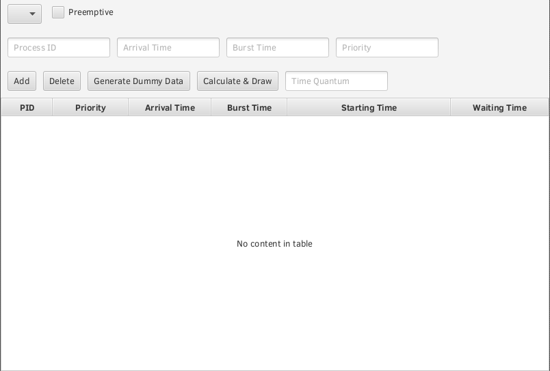

# CpuSchedulingFX
CPU Scheduler implementation using JavaFX

# Scheduler Algorithms:

* First Come First Served (FCFS)
* Shortest Job First - Non Preemptive (SJF - NP)
* Shortest Job First - Preemptive (SJF - P)
* Priority - Non Preemptive
* Priority - Preemptive
* Round Robin (RR)

## How to Run Project?
* Need Maven to run if not installed 
  follow procdeure in link : https://maven.apache.org/install.html
* type `maven package` 
* type `mvn clean javafx:run`
* Done CpuSchedulingFX window open as in the picture.

# CpuSchedulingFX window

## How to Run?
    Choose the scheduling Algorithm from the top left list, Add Processes by filling the
    Text fields (Process ID, Arrival time, Burst time, etc...)  
    Press Calculate & Draw and another window will pop up containing the Gantt chart,
    Average waiting time & Average turnaround time.
